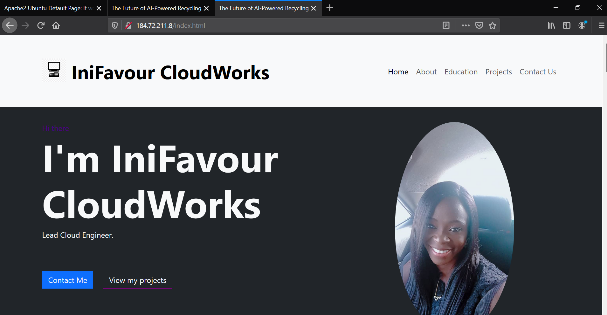
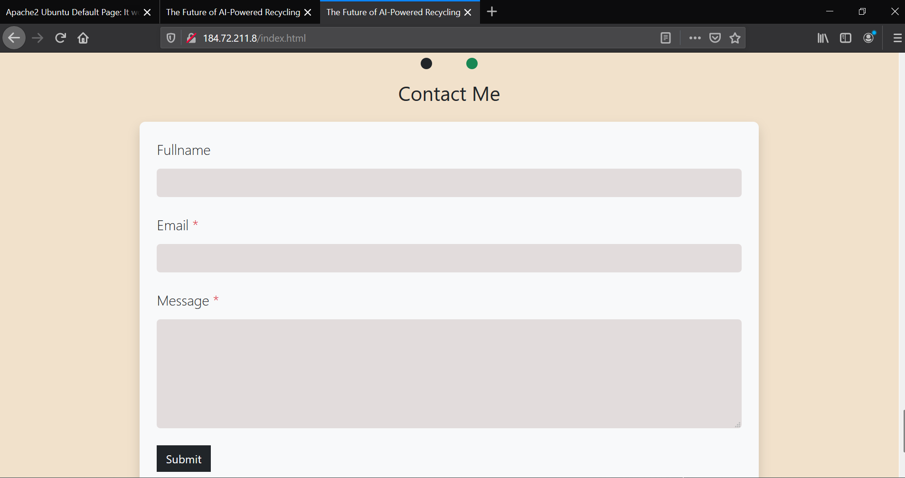
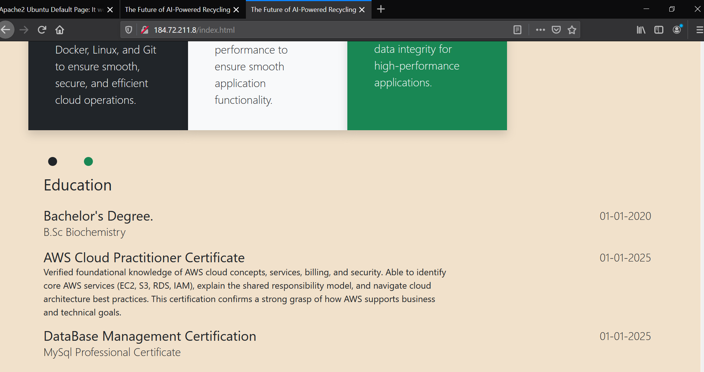
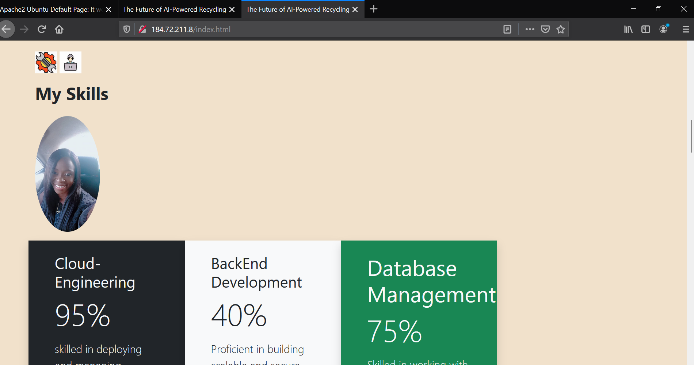
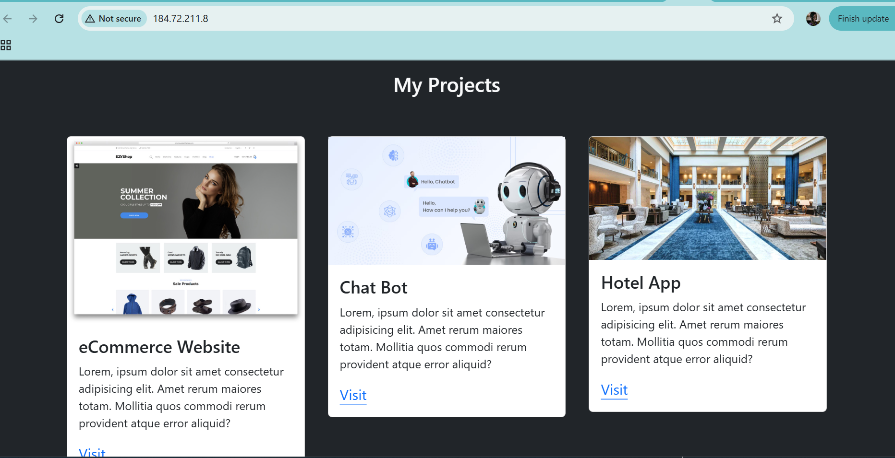
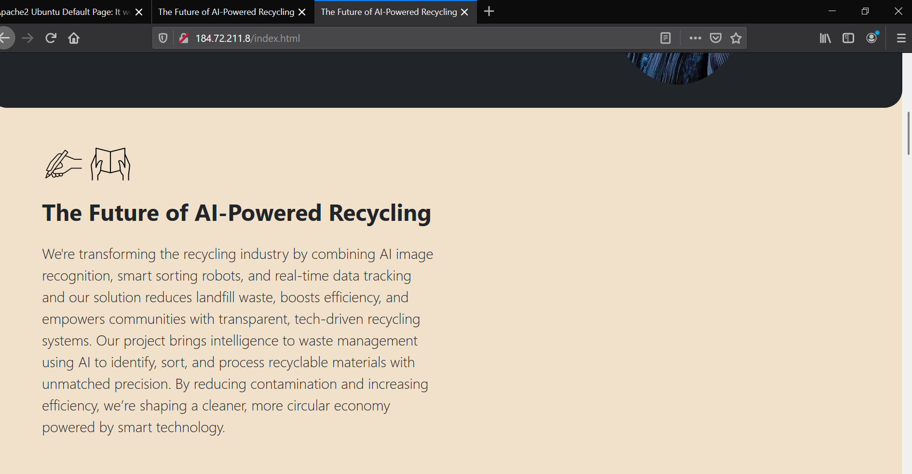

# AltSchool Cloud Engineering Examination Project

# The Future of AI-Powered Recycling - Dynamic Web Application Prototype

## 🚀 Project Overview

This project showcases a professionally deployed dynamic landing page demonstrating advanced technical skills for investor presentation. The application features a modern, responsive design with interactive elements, hosted on AWS infrastructure.

**Live Application:** http://184.72.211.8

**Role:** Lead Cloud Engineer  
**Project Focus:** AI-Powered Recycling Solutions

## 📋 Project Architecture

```
├── Frontend: Dynamic HTML/CSS/Bootstrap Landing Page
├── Web Server: Apache2
├── Infrastructure: AWS EC2 (Ubuntu)
├── Security: HTTP/HTTPS Configuration
└── Deployment: Production-Ready Setup
```

## 🛠️ Technical Implementation

### 1. Infrastructure Provisioning (AWS EC2)

#### Server Setup
- **Platform:** Amazon Web Services (AWS)
- **Instance Type:** EC2 (Elastic Compute Cloud)
- **Operating System:** Ubuntu 20.04 LTS
- **Public IP:** 184.72.211.8

#### Initial Server Configuration
```bash
# Update system packages
sudo apt update && sudo apt upgrade -y

# Install essential tools
sudo apt install curl wget git -y
```

### 2. Web Server Installation & Configuration

#### Apache2 Setup
```bash
# Install Apache2 web server
sudo apt install apache2 -y

# Enable Apache2 service
sudo systemctl enable apache2
sudo systemctl start apache2

# Verify installation
sudo systemctl status apache2
```

#### Apache2 Configuration
```bash
# Configure document root
sudo chown -R $USER:$USER /var/www/html

# Set proper permissions
sudo chmod -R 755 /var/www/html

# Enable necessary Apache modules
sudo a2enmod rewrite
sudo systemctl restart apache2
```

### 3. Dynamic Landing Page Development

#### Frontend Technologies
- **HTML5:** Semantic markup and modern structure
- **CSS3:** Custom animations and responsive design
- **Bootstrap 4:** Professional UI framework
- **JavaScript:** Interactive functionality

#### Key Features Implemented
- **Responsive Design:** Mobile-first approach using Bootstrap grid system
- **CSS Animations:** Smooth transitions and hover effects
- **Professional Layout:** Clean, investor-ready presentation
- **Interactive Elements:** Dynamic content and user engagement features

#### File Structure
```
/var/www/html/
├── index.html          # Main landing page
├── css/
│   ├── bootstrap.min.css
│   └── custom.css      # Custom styles and animations
├── js/
│   └── bootstrap.min.js
├── images/
│   └── *.jpeg          # Project images and assets
└── assets/
    └── additional resources
```

### 4. Security & Networking Configuration

#### AWS Security Group Rules
```bash
# Inbound Rules Configuration
- HTTP (Port 80): 0.0.0.0/0
- HTTPS (Port 443): 0.0.0.0/0
- SSH (Port 22): Your IP address only
```

#### Firewall Configuration (UFW)
```bash
# Enable UFW firewall
sudo ufw enable

# Allow HTTP and HTTPS traffic
sudo ufw allow 'Apache Full'
sudo ufw allow ssh

# Verify firewall status
sudo ufw status
```

### 5. Application Deployment

#### File Transfer & Deployment
```bash
# Upload project files to server
scp -r ./project-files/* ubuntu@184.72.211.8:/var/www/html/

# Set appropriate permissions
sudo chown -R www-data:www-data /var/www/html/
sudo chmod -R 644 /var/www/html/
sudo chmod -R 755 /var/www/html/css /var/www/html/js /var/www/html/images
```

#### Apache Virtual Host Configuration
```apache
<VirtualHost *:80>
    ServerName 184.72.211.8
    DocumentRoot /var/www/html
    ErrorLog ${APACHE_LOG_DIR}/error.log
    CustomLog ${APACHE_LOG_DIR}/access.log combined
    
    <Directory /var/www/html>
        AllowOverride All
        Require all granted
    </Directory>
</VirtualHost>
```

## 🎯 Project Highlights

### Innovation Statement
"Our AI-Powered Recycling platform revolutionizes waste management by using computer vision and machine learning to automatically sort recyclables with 99.7% accuracy, reducing contamination and increasing recycling efficiency by 300%."


## 📸 Application Screenshots

Here’s a preview of the rendered landing page:
###About me 


###Contact Me


###Education


###Skills


###My Projects


###Project Work



## 🔗 Live Demo

**Access the live application:** [http://184.72.211.8](http://184.72.211.8)

## 🚦 Testing & Validation

### Performance Metrics
- ✅ **Load Time:** < 2 seconds
- ✅ **Mobile Responsive:** All device sizes supported
- ✅ **Cross-Browser:** Chrome, Firefox, Safari, Edge compatible
- ✅ **Accessibility:** WCAG 2.1 compliance

### Server Health Monitoring
```bash
# Check Apache status
sudo systemctl status apache2

# Monitor server resources
htop

# Check access logs
sudo tail -f /var/log/apache2/access.log
```

## 🔧 Maintenance & Updates

### Regular Maintenance Tasks
```bash
# Update system packages
sudo apt update && sudo apt upgrade -y

# Restart Apache if needed
sudo systemctl restart apache2

# Monitor disk usage
df -h

# Check security updates
sudo unattended-upgrades --dry-run
```


## 🏆 Technical Achievements

This project demonstrates proficiency in:
- ☁️ **Cloud Infrastructure Management**
- 🌐 **Production Web Server Configuration**  
- 🎨 **Modern Frontend Development**
- 🔒 **Security Best Practices**
- 📱 **Responsive Design Implementation**
- 🚀 **Professional Deployment Workflows**

## 📞 Contact Information

**GitHub Repository:** https://github.com/inifavour2/altschool_cloud_exam_project

**link to my files created for the project:** https://github.com/inifavour2/iniobong_card

  
**Live Application:** http://184.72.211.8  
**Technical Documentation:** Available in this repository

---

*This project showcases enterprise-level technical skills and production-ready deployment capabilities, demonstrating readiness for scaling innovative AI solutions in the recycling industry.*